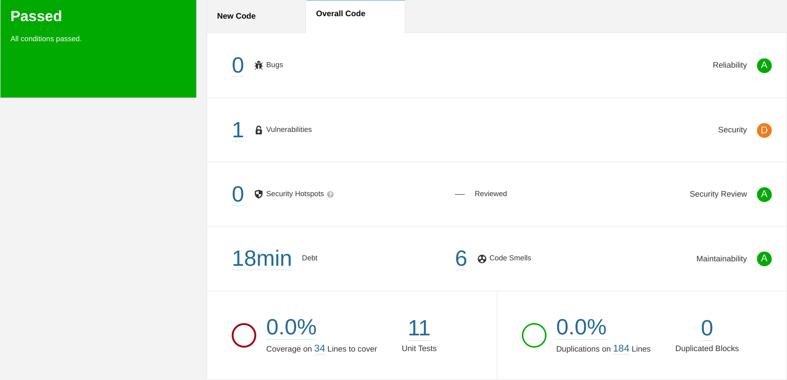

### a) Take note of the technical debt found. Explain what this value means.
Technical debt is the amount of time required to solve the problems identified by SonarQube. In this case it was of 18 minutes.

### d) How many lines are “not covered”? And how many conditions?
0